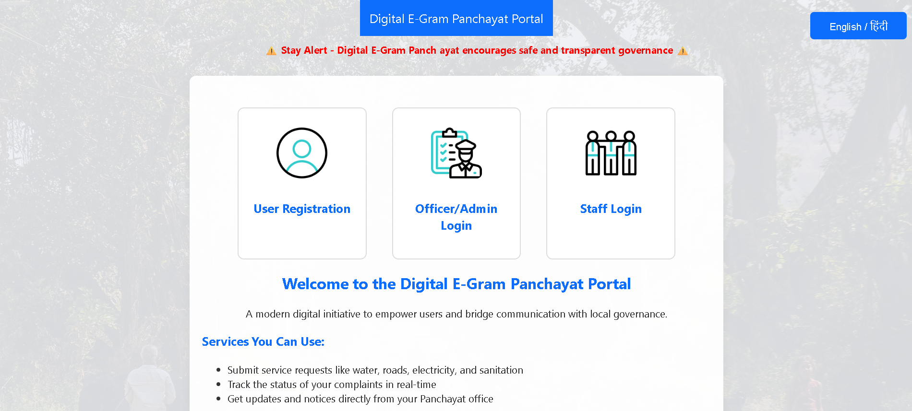

# 🏡 Digital E-Gram Panchayat Portal

A bilingual (English/हिंदी) web-based application designed to streamline service delivery and complaint tracking for rural areas through role-based dashboards — powered by Firebase.


🔗 **Live Demo**: [Click here to view the deployed site](https://ridhima-bhardwaj.github.io/DIGITAL-GRAM-PANCHAYAT/)

---

## 🔥 Features

### 👤 User (Citizen)
- Register/Login with Firebase Authentication
- Submit complaints by category (Water, Road, Electricity, etc.)
- View status and staff/officer responses
- Explore available Gram Panchayat services
- View personal profile

### 🧑‍💼 Officer
- Add new public services
- Edit/Delete posted services
- View and respond to user complaints

### 👨‍🔧 Staff
- View all complaints
- Update status and provide resolution notes

### 🌐 General
- English/हिंदी language toggle
- Protected dashboard routes based on role
- Firebase Firestore for real-time updates
- Clean and responsive UI

---

## 🛠 Tech Stack

- **Frontend**: HTML5, CSS3, JavaScript (Modular)
- **Backend**: Firebase (Firestore, Auth, Storage)
- **Authentication**: Firebase Email/Password Auth
- **Database**: Firebase Firestore (NoSQL)

---

## 🗂 Firestore Collections

| Collection   | Purpose                          |
|--------------|----------------------------------|
| `users`      | Stores user details and role info |
| `services`   | Officer-posted public services    |
| `complaints` | Complaints submitted by users     |

---

## 🚀 Run Locally

1. Clone the repository:
   ```bash
   git clone https://github.com/ridhima-bhardwaj/digital-egram-panchayat.git
   ```
2. Set up Firebase project:
   - Enable Firestore
   - Enable Authentication (Email/Password)
3. Replace the config in `firebase-config.js` with your Firebase project details
4. Open `index.html` in browser or serve with Live Server in VS Code

---

## 📸 Screenshots

### 🏠 Home Page (`index.html`)
Welcome screen of the Digital E-Gram Panchayat Portal.



---

### 📝 Register Page
User registration with role selection (User, Officer, Staff).


---

### 📨 Submit Complaint
Users can submit complaints selecting category and uploading optional image.


---

### 📋 User Dashboard
Quick access to Apply, View Status, My Profile, and Available Services.


---

## 📁 Folder Structure

```
📁 project-root/
├── css/
│   └── style.css
├── js/
│   ├── auth.js
│   ├── admin.js
│   ├── user.js
│   ├── officer.js
│   ├── staff.js
│   ├── services.js
│   ├── manage.js
│   └── firebase-config.js
├── screenshots/
│   └── *.png
├── index.html
├── register.html
├── login.html
├── user-dashboard.html
├── officer-dashboard.html
├── staff-dashboard.html
├── admin-add-service.html
├── manage-services.html
├── submit-complaint.html
├── services.html
├── profile.html
└── README.md
```

---

## 🔐 License

This project is open source under the [MIT License](https://opensource.org/licenses/MIT).  
You’re free to use, modify, and distribute with attribution.

---
